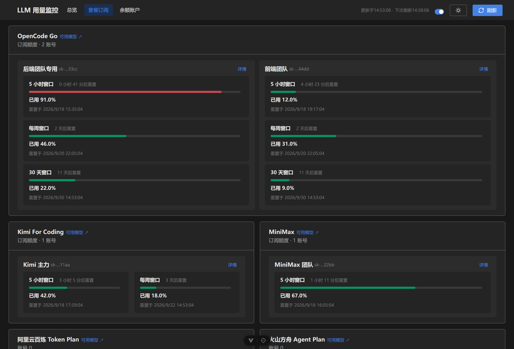

# LLM 用量监控（tracking-llm-plan-usage）

**简体中文** | [English](README.en.md)

[](https://github.com/KS-OTO/tracking-llm-plan-usage/actions/workflows/ci.yml)
[](./LICENSE)
[](https://bun.sh)
[](https://vuejs.org)
[](https://tdesign.tencent.com/vue-next/)
[](package.json)
[](https://cp-ai101.18bit.cn/)

## 简介

开源网页工具：在一个页面集中查看 DeepSeek、火山方舟、智谱、阿里云、模力方舟、百度千帆、OpenRouter、New API（自托管网关）及订阅套餐（Kimi / MiniMax / OpenCode Go）的余额与用量。
只需在环境变量中配置各家 API Key / Access Key，无需任何其他操作。

**在线演示：<https://cp-ai101.18bit.cn/>**

它要解决的问题很具体：这些平台的余额和额度窗口散落在各自的控制台里，有的连 API 都不提供
（只能靠控制台会话 Cookie），想知道「这个月还够不够用」得逐个登录。本项目把这件事收敛成
**一次请求、一个页面**，且在服务端完成全部凭据交互 —— 浏览器侧拿不到任何 Key。

它**不是**代理网关，不转发模型请求，不记录你的对话内容；只做「读余额、读用量」这一件事。

技术栈：Bun + Vue 3 + Vite（Vite+ 工具链：Oxfmt / Oxlint / tsgolint 严格类型检查 / Vitest / Rolldown 构建），
状态管理 Pinia，数据校验 Zod（前后端 JSON 边界统一 schema 校验）。
UI 组件库：TDesign Vue Next（桌面端；官方亮/暗主题 token；响应式 Grid 多列布局；适老化字号基线）。



<sub>截图为「套餐订阅」Tab。同一屏的浅色主题见 [`plans-light.png`](docs/images/plans-light.png)，
「余额账户」Tab 见 [`accounts-dark.png`](docs/images/accounts-dark.png)。</sub>

## 目录

- [简介](#简介) · [功能](#功能) · [对外接口只有 3 个](#对外接口只有-3-个) · [快速开始](#快速开始)
- [部署](#部署到-cloudflare-workers)：[Cloudflare Workers](#部署到-cloudflare-workers) / [EdgeOne Makers](#部署到-edgeone-makers) / [其他平台](#部署到其他平台vercel-等)
- [环境变量](#环境变量) · [多账号支持](#多账号支持) · [站点自定义](#站点自定义站点名--logo--favicon--刷新间隔)
- [常用命令](#常用命令) · [目录结构](#目录结构) · [参考文档](#参考文档)
- [安全](#安全) · [贡献](#贡献) · [许可证](#许可证) · [English](README.en.md)

## 功能

页面特性：

- **响应式多列布局**：桌面多列并排、平板两列、手机单列；平台按「套餐订阅 / 余额账户」Tab 分组，告别单列长下拉。
  布局只由 `src/assets/layout.css` 的语义化网格原语决定（组件不写断点）：**每一层卡片都铺满上一层给它的高度**，
  所以同一行的区块卡 → 卡内账号卡 → 账号卡内窗口块**三层都严格等高**；
  卡内挂了 ≥2 个 Key 的区块会自动**独占整行**，让多个 Key 并排而不是被挤成「一行一个 + 换行」。
- **窄屏导航不溢出**：≤767px 时导航收成两行——品牌与操作区同行、三个 Tab 在第二行**等分整行**；
  时间文案下移到内容区顶部（导航里只留「下次刷新」）。锚点避让量跟着导航实际高度走
  （`--app-menu-h` / `--app-anchor-offset`），跳锚点不会把标题压在导航下面。
- **平台卡排序**：**Key（账号）多的平台排前面**（3 Key > 2 Key > 1 Key），数量相同时按平台名首字母 A→Z。
  首字母对中文取拼音、对拉丁名取字母，混在同一个序列里（阿里→A、百度→B、DeepSeek→D、模力→M、
  OpenRouter→O、智谱→Z），而不是把英文平台一律丢到汉字后面。
  「套餐订阅」「余额账户」两个 Tab 与总览的「平台导航」卡片用同一套顺序，导航卡点哪家就落在页面对应位置。
- **「可用模型」直达文档**：每张平台卡的标题旁都有「可用模型 ↗」，新标签打开该平台官方的模型/计费文档
  ——火山方舟、智谱 GLM、阿里云百炼、DeepSeek、模力方舟、百度千帆、OpenRouter、OpenCode Go、Kimi、MiniMax 全覆盖。
  链接按**卡片标题（平台名）**在 `src/modelDocs.ts` 统一查表：同一平台在不同 Tab 标题不同
  （如「智谱 GLM Coding Plan」与「智谱 GLM 余额」）也只需一条关键词映射，新增平台卡补一行即自动生效。
  总览「平台导航」卡上同样有该链接；点链接只开文档，不会顺带触发卡片本身的锚点跳转。
- **刷新节奏可预期**：顶部同时显示「更新于 HH:MM:SS」与「下次刷新 HH:MM:SS」（默认每 180 秒，
  可用 `REFRESH_INTERVAL_SECONDS` 调整）；
  关掉自动刷新或页面切到后台时后者显示「已暂停」——不给一个根本不会到来的时间。
- **站点可自建品牌**：站点名 / Logo / favicon 都能用环境变量替换，见「站点自定义」。
- **暗色模式**：一键切换并持久化（localStorage），默认跟随系统 `prefers-color-scheme`。
- **可访问性**：语义化地标（header/main/footer）、键盘可达、aria 标注、对比度对齐 TDesign 官方 token。
- **骨架屏 / 错误告警 / 空状态**：统一由 TDesign Skeleton / Alert / Empty 承载。
- **卡片只放高优先级读数**：卡片上只有窗口用量 / 余额 / 状态这类每天要看的数字；
  账号身份、订阅元数据、明细表、次级指标全部收进卡片右上角的「详情」弹窗，需要时才展开。
- **账号别名**：多 Key 场景下 `*_LABEL` 给每个 Key 起人类可读的名字，卡片主标题显示别名、
  Key 掩码退居次要位置（详见「账号别名」）。

| 数据源                | 接口                                                                                                                                                                                            | 展示内容                                                                                                                                                                                  |
| --------------------- | ----------------------------------------------------------------------------------------------------------------------------------------------------------------------------------------------- | ----------------------------------------------------------------------------------------------------------------------------------------------------------------------------------------- |
| DeepSeek              | `GET /user/balance`                                                                                                                                                                             | 总余额、充值余额、赠金余额（CNY/USD）、可用状态                                                                                                                                           |
| 火山方舟 Agent Plan   | `GetPersonalPlan` + `GetAFPUsage` + `GetUsageDetails` + `GetCodingPlanUsage` + `GetInferenceUsage`                                                                                              | 卡片上是 Agent Plan 的 5 小时/模型日额度/每周/每月配额与进度、重置倒计时；套餐档位与有效期、Coding Plan 状态与窗口额度、模型调用明细、近 N 天推理用量（可按模型过滤）全部收进「详情」弹窗 |
| 智谱 GLM              | `GET /api/monitor/usage/quota/limit`（Coding Plan）+ 控制台 biz API（余额/资源包）                                                                                                              | Coding Plan 套餐等级与 5 小时/每周窗口额度、账户余额、Token 资源包明细                                                                                                                    |
| 阿里云百炼            | `QueryResourcePackageInstances`（BSS）                                                                                                                                                          | Token 资源包实例：总量/剩余、有效期、状态、适用产品（需 BSS 只读权限）                                                                                                                    |
| 阿里云百炼 Token Plan | ModelStudio OpenAPI（ROA）：`GetSubscriptionSeatDetails` / `ListSubscriptionSharedPackages`；个人版用量经控制台网关（`zeldaHttp.apikeyMgr./tokenplan/personal/api/v2/*`，Cookie 或 AK/SK 均可） | TokenPlan 账户/组织信息、订阅座席与共享包的 CREDITS 额度周期、总额/剩余；**个人版** 5 小时/7 天窗口用量、订阅状态与剩余天数、加购包 Credits、重置卡                                       |
| 模力方舟（Gitee AI）  | `GET /tokens/packages/balance` + 内部接口（Cookie）                                                                                                                                             | 资源包总金额/已用/剩余、代金券余额与明细（需配置会话 Cookie）                                                                                                                             |
| 百度智能云千帆        | 平台功能 OpenAPI（/v2/charge + /v2/service，BCE AK/SK 签名）                                                                                                                                    | 量包（总量/已用/到期/状态）+ TPM 配额 + 近 7 天调用概览（Token/次数/服务数）                                                                                                              |
| OpenRouter            | `GET /api/v1/credits` + `GET /api/v1/key`                                                                                                                                                       | 剩余额度 / 限额剩余 / 今日用量（「余额账户」Tab）；充值总额、周月用量、密钥元数据在「详情」弹窗内                                                                                         |
| New API（自托管网关） | 管理接口 `/api/user/self` + `/api/log/self/stat` + `/api/data/self`（系统访问令牌）；无管理权限时回落 OpenAI 兼容 `/v1/dashboard/billing/*`（普通 API Key）                                     | **订阅**（周期额度窗口：已用百分比、周期额度、下次重置时间）归「套餐订阅」；**钱包**（剩余 / 累计已用 / 请求数）归「余额账户」；两者并存时订阅为主、钱包作次要读数                        |
| 订阅套餐（可选）      | Kimi For Coding（`/coding/v1/usages`）/ MiniMax（`coding_plan/remains`）/ **OpenCode Go**（`/zen/go/v1/usage`），统一走 `/api/usage` 的 `plans` 切片                                            | 按窗口计的**订阅额度**，与火山/智谱/百炼并列在「套餐订阅」Tab；**一平台一张卡，卡片标题即平台名**，卡显示窗口进度条，账号身份与窗口明细在「详情」弹窗内                                   |

密钥只存在于服务端环境变量，前端页面不接触任何 Key（仅展示掩码）。

### 对外接口只有 3 个

页面挂在边缘云上，而部分平台按**节点生存时间**计费——端点数直接决定唤醒次数与单次存活时长。
因此所有读数合并成 3 个接口（此前是 13 个）：

| 接口                            | 何时调用             | 说明                                                                                                           |
| ------------------------------- | -------------------- | -------------------------------------------------------------------------------------------------------------- |
| `GET /api/status`               | 首屏一次             | 只回**配置状态**（哪些平台配了几个 Key、缺哪一半、站点自定义），**0 次上游调用**，因此极快                     |
| `GET /api/usage`                | 每次刷新             | 10 家平台的读数合并成**一封信封**，见下                                                                        |
| `GET /api/volc/inference-usage` | 按需（改模型过滤时） | 火山推理用量。**故意不合并**：它是唯一带用户输入的读数接口，并入会让「改一个模型过滤」退化成「全量重拉 10 家」 |

`/api/usage` 的信封形状：

```jsonc
{
  "providers": {
    "deepseek": { "data": { "accounts": [] } }, // 成功
    "newapi": { "error": "未配置 …", "code": "NOT_CONFIGURED" }, // 未配置
    "zhipu": { "error": "…", "code": "Zhipu_HTTP_500" }, // 真实失败
  },
  "fetchedAt": 1789616585319,
}
```

两个设计要点：

- **每个平台是独立切片**，一家的失败不会污染其余九家（也不会让整封信封变成 500）。
  未配置走 `NOT_CONFIGURED`，前端渲染成中性空态而不是错误墙。**未配置的 Key 不影响其他平台出卡**。
- **服务端有 TTL 缓存 + 单飞（single-flight）**：命中缓存时**上游调用为 0**，并发刷新共享同一次上游请求。
  TTL 按数据变化节奏分两档——余额/用量类 60 秒，结构/权益类（资源包、套餐、座席）300 秒。
  默认刷新间隔 180 秒，所以按天计的那几项大约每两次自动刷新才真正打一次上游。
  **手动点「刷新」会绕过缓存**（`?refresh=1`），因此手动刷新永远拿得到实时数据。

## 快速开始

```bash
bun install
cp .env.example .env      # 填入你的 Key
vp dev                    # 单命令启动：前端 + 内置 API（读取 .env）
```

打开 http://localhost:5173 查看仪表盘。

> 开发模式内置 API：`server/app.ts` 已挂载进 Vite dev server，`vp dev` 单进程即可，
> 无需另开后端。`bun run dev:all`（后端 + 前端分开跑）仍可用。

生产模式：

```bash
vp build                  # 构建前端到 dist/
bun run server            # Bun 服务：同一端口提供 API 与静态页面
```

打开 http://127.0.0.1:8787 查看仪表盘。

## 部署到 Cloudflare Workers

单命令部署（构建 + 上传一次完成）：

```bash
bun run deploy            # = vp build && wrangler deploy
```

- 静态资源：Workers Assets 托管 `dist/`（SPA 回退已配置）
- API：`worker/index.ts` 复用 `server/app.ts`（平台无关 + Web Crypto 签名）
- 密钥：`wrangler secret put DEEPSEEK_API_KEY` 等逐项配置；本地调试用 `.dev.vars`（参考 `.dev.vars.example`）
- 多账号变量同样按 `_N` 后缀命名（如 `DEEPSEEK_API_KEY_2`）

## 部署到 EdgeOne Makers

仓库已含 Makers 适配层，在控制台把函数目录指向 `cloud-functions/` 即可：

- `cloud-functions/api/[[default]].js` —— `/api/*` 全捕获，动态 `import('../../server/app.ts')`
  复用同一份 `createAppHandler`；依赖链加载失败时返回结构化 `FN_IMPORT_FAILED`（而不是裸崩成 5xx HTML）。
- `cloud-functions/api/diag.js` —— 零依赖自诊断，访问 `/api/diag` 可区分「函数系统故障」与「依赖链加载失败」，
  并列出运行时已知的环境变量名（Key/Secret 类只显示 `<set>`），用于确认线上变量是否注入成功。
- `edgeone.json` 配置云函数超时与区域（`maxDuration: 60`，广州 / 新加坡）。
- 环境变量在 Makers 控制台 EnvVars 配置，经 `context.env` 注入；同样支持 `_N` 多账号。

## 部署到其他平台（Vercel 等）

`server/app.ts` 是平台无关的（只依赖 Web Fetch API 与 Web Crypto，不使用 `node:crypto`），
只要有「单一 HTTP 入口 + 环境变量注入」的平台都可以承载，`api/` 下的适配层照着
`cloud-functions/api/[[default]].js` 改写即可。

平台面板配置环境变量时有两条硬约束，配置前请先读「Cookie 怎么填」：

- **值不能含空格/换行/制表符** —— 所以百炼 Cookie 只粘 ticket 的**值**，别粘整段 `Cookie` 头；
  必须用整段的（模力方舟会话 Cookie）先 `encodeURIComponent`，详见「Cookie 怎么填」。
- **面板不做 `$` 变量展开** —— 直接粘原值，**不要**加 `\$`（那是本地 `.env` 才需要的写法）。

另外两点容易踩：

- **改完变量必须重新部署才生效**：Vercel / Workers 的部署产物在构建期固化配置，
  改面板上的值不会影响已经在跑的实例，要触发一次新部署（或在面板点 Redeploy）。
- **用 CLI 配置时别用 `echo`**：`echo` 会附带回车换行，正是面板拒绝的「换行符」。
  服务端会把值 `trim()` 掉，因此写入的换行不会损坏查询，但面板会直接拒绝这一笔。

  ```bash
  # ✅ printf 不带换行
  printf '%s' '<login_aliyunid_ticket 的值>' | vercel env add ALIYUN_TOKENPLAN_COOKIE production
  # ❌ echo 会写入尾部 \n
  echo '<值>' | vercel env add ALIYUN_TOKENPLAN_COOKIE production
  ```

  排查线上「会话已失效」时，报错会附带**当前配置值的长度**，与浏览器中复制的值比对：

  - **偏短** → 本地 `.env` 里的字面 `$` 未转义，被变量展开吃掉了字符；
  - **长度一致但仍失败** → 大概率是会话真过期，重新复制即可。

## 多账号支持

每个平台支持多组凭据：第 1 组使用基础变量名，第 N 组在变量名后加 `_N` 后缀（连续编号，遇到缺失即停）。
例如 DeepSeek 三个账号：`DEEPSEEK_API_KEY`、`DEEPSEEK_API_KEY_2`、`DEEPSEEK_API_KEY_3`。
成对凭据（AccessKey/SecretKey）同编号成组：`VOLC_ACCESS_KEY_ID_2` + `VOLC_SECRET_KEY_2`。
每个账号独立查询、独立容错，仪表盘按账号卡片展示。

### 账号别名（多 Key 团队建议配置）

Key 掩码（`sk-f61c****L3Qe`）对人而言没有可读性——同一平台挂 5 个 Key 时无法判断哪个是哪个。
给每个 Key 配一个别名，卡片主标题就显示别名，Key 掩码退居次要位置（仅作消歧）。

变量名规则：**在凭据变量名前缀后加 `_LABEL`**，第 N 组同样加 `_LABEL_N`，按**序号**与凭据配对。

```bash
# 5 个 OpenCode Go 订阅，按团队标注归属
OPENCODE_GO_API_KEY=sk-aaaa...
OPENCODE_GO_LABEL=前端团队专用订阅
OPENCODE_GO_API_KEY_2=sk-bbbb...
OPENCODE_GO_LABEL_2=后端团队专用 Key
OPENCODE_GO_API_KEY_3=sk-cccc...
OPENCODE_GO_LABEL_3=算法组（长上下文）
```

各平台对应的别名前缀：

| 平台                                    | 凭据变量                  | 别名变量                 |
| --------------------------------------- | ------------------------- | ------------------------ |
| DeepSeek                                | `DEEPSEEK_API_KEY`        | `DEEPSEEK_LABEL`         |
| 火山方舟                                | `VOLC_ACCESS_KEY_ID`      | `VOLC_LABEL`             |
| 智谱 GLM                                | `ZHIPU_API_KEY`           | `ZHIPU_LABEL`            |
| 阿里云（资源包 / Token Plan 组织·座席） | `ALIYUN_ACCESS_KEY_ID`    | `ALIYUN_LABEL`           |
| 阿里 Token Plan 个人版（仅 Cookie）     | `ALIYUN_TOKENPLAN_COOKIE` | `ALIYUN_TOKENPLAN_LABEL` |
| 模力方舟                                | `GITEE_AI_API_KEY`        | `GITEE_LABEL`            |
| 百度千帆                                | `BAIDU_ACCESS_KEY_ID`     | `BAIDU_LABEL`            |
| OpenRouter                              | `OPENROUTER_API_KEY`      | `OPENROUTER_LABEL`       |
| Kimi For Coding / MiniMax               | `KIMI_API_KEY` 等         | `KIMI_LABEL` 等          |
| OpenCode Go                             | `OPENCODE_GO_API_KEY`     | `OPENCODE_GO_LABEL`      |

三条容易踩的规则：

- **按序号配对，不按值配对**。`*_LABEL_2` 对应的是第 2 组凭据；中间断号（有 `_1`、`_3` 没 `_2`）会让后续组全部读不到。
- **别用 `ALIYUN_LABEL` 标 Cookie 专属账号**：没有 AK/SK 时 `ALIYUN_LABEL` 找不到配对项，别名会被忽略——这种情况请用 `ALIYUN_TOKENPLAN_LABEL`。
- **同一序号两种凭据并存时（AK/SK + Cookie）**，别名取 `ALIYUN_LABEL`（两者本就是同一账号，只出一张卡）。

别名只影响展示，不参与任何鉴权或查询。

## 环境变量

全部变量（含账号别名 `*_LABEL`）都登记在 `server/env-vars.ts` 的 `SERVER_ENV_VARS` 里 ——
那是唯一的事实来源，新增平台时改它，`.env.example` 与 `.dev.vars.example` 会被
`server/env-vars.test.ts` 校对（漏登记会直接测试失败，不会出现「文档写着有、配了却不生效」）。

三份配置文件的分工，同一段说明只在一处维护：

| 文件                | 用途                                                             |
| ------------------- | ---------------------------------------------------------------- |
| `.env.example`      | **主模板**：变量最全、说明最详细，也是平台面板填变量时的参考     |
| `.dev.vars.example` | Cloudflare Workers 版：**同集合同顺序**，只讲 Workers 专属差异   |
| `.env`              | 本机真实值（gitignored、不入库），分组顺序与 `.env.example` 一致 |

| 变量                       | 必填 | 说明                                                                                                       |
| -------------------------- | ---- | ---------------------------------------------------------------------------------------------------------- |
| `DEEPSEEK_API_KEY`         | 否   | DeepSeek API Key（余额查询），在 https://platform.deepseek.com/api_keys 获取                               |
| `VOLC_ACCESS_KEY_ID`       | 否   | 火山方舟 Access Key ID（管控面 API 签名）                                                                  |
| `VOLC_SECRET_KEY`          | 否   | 火山方舟 Secret Access Key                                                                                 |
| `ZHIPU_API_KEY`            | 否   | 智谱开放平台 API Key（资源包/余额），在 https://open.bigmodel.cn/usercenter/apikeys 获取                   |
| `ALIYUN_ACCESS_KEY_ID`     | 否   | 阿里云 AccessKey ID（BSS 资源包 + Token Plan 组织/座席），在 https://ram.console.aliyun.com/manage/ak 创建 |
| `ALIYUN_SECRET_KEY`        | 否   | 阿里云 AccessKey Secret                                                                                    |
| `ALIYUN_TOKENPLAN_COOKIE`  | 否   | 百炼控制台 Cookie 中 `login_aliyunid_ticket` 的**值**（Token Plan 个人版用量，无需授权；详见下文取值注意） |
| `GITEE_AI_API_KEY`         | 否   | 模力方舟（Gitee AI）访问令牌（资源包余额），在 https://ai.gitee.com 生成                                   |
| `GITEE_AI_SESSION_COOKIE`  | 否   | 模力方舟 Web 会话 Cookie（代金券查询；整段含空格，平台面板需填编码值，见「Cookie 怎么填」）                |
| `BAIDU_ACCESS_KEY_ID`      | 否   | 百度智能云千帆 Access Key ID（BCE 签名），在 https://console.bce.baidu.com/iam/#/iam/accesslist 创建       |
| `BAIDU_SECRET_KEY`         | 否   | 百度智能云千帆 Secret Access Key（建议子账号 + `QianfanServiceReadAccessPolicy` 只读）                     |
| `OPENROUTER_API_KEY`       | 否   | OpenRouter 剩余额度与限额，在 https://openrouter.ai/keys 获取                                              |
| `KIMI_API_KEY`             | 否   | Kimi For Coding Token Plan 额度，在 https://platform.moonshot.cn 获取                                      |
| `MINIMAX_API_KEY`          | 否   | MiniMax Token Plan 额度，在 https://platform.minimaxi.com 获取                                             |
| `OPENCODE_GO_API_KEY`      | 否   | OpenCode Go 订阅额度（5 小时/7 天/30 天窗口），在 https://opencode.ai 获取                                 |
| `NEWAPI_BASE_URL`          | 否   | New API 站点地址（自托管，形如 `https://ai.example.com/`），多站点按 `_2` / `_3` 追加                      |
| `NEWAPI_TOKEN`             | 否   | New API **系统访问令牌**（管理接口鉴权，见下方「令牌怎么取」），多站点按 `_2` / `_3` 追加                  |
| `NEWAPI_USER_ID`           | 否   | 管理接口需要按用户查询时的用户 ID（与 `NEWAPI_BASE_URL` 同序号配对，选填）                                 |
| `NEWAPI_LABEL`             | 否   | 站点别名（与 `NEWAPI_BASE_URL` 同序号配对，选填）                                                          |
| `SITE_NAME`                | 否   | 站点名称（导航栏品牌位 + 浏览器标签页标题），默认「LLM 用量监控」，见下文「站点自定义」                    |
| `SITE_LOGO_URL`            | 否   | 明亮模式 Logo 图片地址（须 https；浏览器直连，不受 CORS 限制），未配置则只显示文字标题                     |
| `SITE_LOGO_URL_DARK`       | 否   | 暗黑模式专用 Logo 地址（须 https）；未配置则暗黑模式沿用 `SITE_LOGO_URL`                                   |
| `SITE_FAVICON_URL`         | 否   | 标签页图标地址（须 https），未配置则保留自带的 `/favicon.ico`                                              |
| `REFRESH_INTERVAL_SECONDS` | 否   | 前端自动刷新间隔（秒），默认 `180`，允许 10–3600                                                           |
| `HOST`                     | 否   | 监听地址，默认 `127.0.0.1`                                                                                 |
| `PORT`                     | 否   | 监听端口，默认 `8787`                                                                                      |

火山方舟 Access Key 在 https://console.volcengine.com/iam/keymanage 创建；出于安全考虑建议使用 IAM 子用户并仅授予方舟相关权限。
阿里云 AccessKey 建议使用 RAM 子用户：Token Plan 组织/座席区块需要 `AliyunTokenPlanReadOnlyAccess` 策略；资源包区块需要费用中心（bss:QueryResourcePackageInstances）只读权限，可按需分别授权。个人版用量用会话 Cookie 即可，无需任何授权。
各平台变量都配置齐全后才会启用对应页面。每个凭据变量都支持同序号的 `*_LABEL` / `*_LABEL_N` 别名（详见「账号别名」）。

OpenCode Go 的用量接口在 200 响应中为每个窗口附带 `status`（`ok` / `rate-limited`）。当某窗口被上游限流时，接口报 `percent: 100` 且 `status: "rate-limited"`——两者语义不同，因此面板会把该状态单独标为「上游限流中」并附说明，而不是只显示 100%。

New API 是**自托管网关**，同一套服务端可能开启两种计费模式：充值的「钱包余额」（只减不重置）与「订阅额度」（按周期窗口重置，常见 30 天）。
服务端用管理接口返回的配额字段与订阅状态共同判定该账号属于哪一类，并据此把它归到正确的 Tab——所以「提交的 Key 到底属于哪种模式」不需要你手工声明。
两种都开启时（`mode: 'both'`）以订阅为主读数、钱包作次要读数，弹窗里给出站点的扣费偏好（`subscription_first` / `wallet_first`）。
站点地址由你填写，因此卡片上的「控制台 ↗」（`{baseUrl}/dashboard`）与「可用模型 ↗」（`{baseUrl}/pricing`）都按该地址拼接；多站点时不给出卡片级链接（一个链接指不了两个站点），改在各自弹窗内提供。

> **取值规则因环境而异**：平台面板（Vercel / EdgeOne Makers / Cloudflare Workers）**原样保存**变量值、不做变量展开；
> 本地 `.env` / `.dev.vars` 会展开 `$`。含 `$` 的值（如百炼 ticket）在本地必须转义——详见「Cookie 怎么填」。

### 站点自定义：站点名 / Logo / favicon / 刷新间隔

四项都用环境变量配置。为什么不做成前端构建期变量（`VITE_*`）：同一份构建产物要跑在
Bun / Cloudflare Workers / EdgeOne / Vercel 四种宿主上，而部署流程让用户在**平台面板**里配的
就是运行时变量——用构建期变量会把「换个站点名」变成「重新构建并重传产物」。
服务端在启动时读取这些变量并随 `/api/status` 下发，因此**改完重启服务即生效，无需重新构建前端**。

| 变量                       | 默认值                | 作用                                             |
| -------------------------- | --------------------- | ------------------------------------------------ |
| `SITE_NAME`                | `LLM 用量监控`        | 导航栏品牌位 + 标签页标题；**留空则只显示 Logo** |
| `SITE_LOGO_URL`            | 无（只显示文字）      | 明亮模式的 Logo（也是暗黑模式的回落值）          |
| `SITE_LOGO_URL_DARK`       | 沿用 `SITE_LOGO_URL`  | 暗黑模式专用的 Logo                              |
| `SITE_FAVICON_URL`         | 自带的 `/favicon.ico` | 浏览器标签页图标                                 |
| `REFRESH_INTERVAL_SECONDS` | `180`                 | 前端自动刷新间隔（秒），允许 10–3600             |

关于站点名的两点注意：

- **可以留空**：`SITE_NAME=`（显式留空）表示品牌位**只显示 Logo** —— Logo 本身已是
  「图形 + 品牌名」的完整字标时很常见，再并一个站点名会读成两个品牌名。
  注意「留空」与「不配」不同：**不配** `SITE_NAME` 会显示默认名 `LLM 用量监控`；
  **留空**才只显示 Logo。留空时浏览器标签页标题回落到默认名（空标题在标签栏里是一片空白）。
- **过长会截断**：品牌位用省略号截断，不会把导航顶出视口。

关于 Logo 主题的两点注意：

- **可配两套图**：`SITE_LOGO_URL`（明亮）与 `SITE_LOGO_URL_DARK`（暗黑）。
  深色字标落在深色导航上会糊成一片，所以「字标型」Logo 两套都配才完整。
  切换主题时即时换图（另一套在首屏已预热，不会出现加载空档让站点名左右抖动）。
- **回落是有序的**：当前主题那套没配或加载失败 → 自动换另一套；两套都不可用才退回纯文字。
  「暗色图忘了配」不会让品牌位空掉，只是对比度差一些（更容易被发现并补上）。

关于图片地址的三点注意：

- **不受 CORS 限制**：Logo 与 favicon 由浏览器通过 `` / `new Image()` 直接加载，
  服务端既不代理也不读像素——需要 `crossorigin` 的是 canvas 读回，不是显示。跨域图床可以直接用。
- **必须 https**：http 资源在 https 页面上会被按混合内容拦掉，表现为「配了却一直看不到」。
  用内网图床时尤其容易踩。
- **加载失败会自动降级**：Logo 先换另一套、仍不行才退回纯文字品牌位；favicon 失败保留自带图标。
  都不留破图，地址写错不会把页面搞坏，只是看不到自定义效果。

Logo 采用**高度固定、宽度自适应**，高度与宽度上限按断点收缩：

| 断点 | Logo 高度 | 宽度上限 | 品牌位与站点名的间距 |
| ---- | --------- | -------- | -------------------- |
| 桌面 | 24px      | 132px    | 12px                 |
| 平板 | 24px      | 108px    | 12px                 |
| 手机 | 20px      | 72px     | 8px                  |

高度取 24px 而不是更大，是因为常见的 Logo 是「图形 + 品牌名」的横版字标，**字标部分通常
只占画布高度的 ~70%**：盒子给 28px 时字标实际会画到约 19px，比 18px 的站点名还大，
两个词标叠在一起就分不出主次；给 24px 时字标约 16.6px，与站点名齐平。
宽度上限反过来必须留够（手机 72px ≈ 20px × 3.6），否则 `object-fit: contain` 会把整幅
画布按宽度压扁，字标反而更小。见 `src/assets/layout.css` 第 5 节。

导航在 **≤1199px** 时会把「更新于 / 下次刷新」从导航行下移到内容区顶部（手机原本就这么做）：
实测 768 视口下导航行已无余量，站点名会被挤压成「AI…」。时间文案晚一步出现，站点名才完整。

刷新间隔做了 10–3600 秒钳制：填 `0` 或非数字回落成默认 180 秒
（`setInterval(fn, 0)` 会退化成尽可能快的忙循环，等于把「自动刷新」变成打爆上游请求），
超出范围钳到最近的边界。页面隐藏时自动暂停不受该变量影响。

### New API 令牌怎么取（`NEWAPI_TOKEN`）

变量叫 `TOKEN` 而不是 `KEY`，是因为这个框里要填的是**系统访问令牌**，不是控制台里 `sk-` 开头的
**模型调用密钥**。两者都能通过站点鉴权，但权限不同，填错的表现是「填了却永远读不到数据」：

- **系统访问令牌（推荐）**：登录你的 New API 站点 →「个人设置 → 安全设置 → 系统访问令牌」→ 生成，
  把整串令牌粘进 `NEWAPI_TOKEN`。它能读管理接口，卡片字段最完整。
  官方文档：https://docs.newapi.ai/zh/docs/api/management/auth
- **模型调用密钥（`sk-…`，可用但不推荐）**：程序检测到管理接口 401 后会自动降级到 OpenAI 兼容的
  账单接口（`/v1/dashboard/billing/*`），读数仍然正确，但拿不到用户名与按模型明细。

### New API 的货币单位怎么读（不再写死 USD）

不同站点的 `quota` 计费口径不一样（美元额度 / 人民币额度 / 自定义代币），所以读数不能一律按 `$` 显示。
程序会先读站点的**公开接口** `GET {baseUrl}/api/status`（无需鉴权），拿到单位类型与换算参数后按
站点官方口径折算——换算规则照抄官方 `setting/operation_setting/general_setting.go` 与 `logger.LogQuota`：

| `quota_display_type` | 显示符号                 | 换算                                                     |
| -------------------- | ------------------------ | -------------------------------------------------------- |
| `USD`（站点默认）    | `$`                      | `quota / quota_per_unit`                                 |
| `CNY`                | `¥`                      | `quota / quota_per_unit × usd_exchange_rate`             |
| `CUSTOM`             | `custom_currency_symbol` | `quota / quota_per_unit × custom_currency_exchange_rate` |
| `TOKENS`             | `点`                     | 原始 `quota`（不折算）                                   |

换算因子 ≤ 0 时按 `1` 处理，符号为空时按 `¤` 处理。`/api/status` 拿不到（站点关闭该接口或字段缺失）时
按官方默认值 **USD** 兜底——官方默认展示类型本身就是 USD。

> 想探测货币单位要看 `/api/status`；官方文档里的 `GET /api/pricing` 只有模型价格表，**不含币种信息**。

### 阿里云百炼 Token Plan 的权限说明

- **组织/座席视图**（团队版）走 ModelStudio OpenAPI（ROA + AK/SK），只需 `AliyunTokenPlanReadOnlyAccess`。
- **个人版用量**（5 小时/7 天窗口、订阅状态、加购包、重置卡）官方**未提供 AK/SK 直调的公开接口**：
  实测 `GET https://dashscope.aliyuncs.com/api/v1/tokenplan/*`（Bearer API Key）系列当前
  在网关返回空体 404（路由未注册，非鉴权失败）。项目提供两条等价通道，**Cookie 优先**：

  1. **控制台会话 Cookie（推荐，开箱可用）** —— 与百炼控制台页面自身的请求完全一致：
     `POST https://bailian-cs.console.aliyun.com/data/api.json?action=BroadScopeAspnGateway&product=sfm_bailian&api=…`
     ，Cookie 鉴权。登录 https://bailian.console.aliyun.com 后，从
     DevTools → Application → Cookies → `bailian.console.aliyun.com`，
     复制 **`login_aliyunid_ticket`** 的值写入 `ALIYUN_TOKENPLAN_COOKIE`
     （实测仅此一个 Cookie 即可；其余 Cookie、Origin/Referer 均非必需）。
     **无需 AK/SK，无需任何 RAM 授权**；会话过期（通常数周）后重新复制即可。
     仅有该 Cookie 时也可独立使用——此账号会显示「仅配置会话 Cookie」，组织/座席区块自动隐藏。
     **取值写法见下文「Cookie 怎么填」——填错会静默损坏且报错与「会话过期」同形。**

  2. **AK/SK 通道**（官方 CLI `bl usage token-plan` 的等价实现，原生移植、无子进程）：
     AK/SK 以 `ACS3-HMAC-SHA256` 调用 `GenerateCLIAccessToken` 换取控制台 access token，
     再经控制台网关调用 `zeldaHttp.apikeyMgr./tokenplan/personal/api/v2/*`。
     此路径需要 RAM 子用户额外授予以下自定义策略：

  ```json
  {
    "Version": "1",
    "Statement": [
      {
        "Effect": "Allow",
        "Action": "modelstudio:GenerateCLIAccessToken",
        "Resource": "*"
      }
    ]
  }
  ```

  未配置 Cookie 且未授权时，页面会在「个人版套餐用量」处给出黄色提示，组织/座席视图不受影响。

### 阿里云两块凭据是共存关系，不是二选一

`ALIYUN_ACCESS_KEY_ID` / `ALIYUN_SECRET_KEY` 与 `ALIYUN_TOKENPLAN_COOKIE` **各管一块数据，互不替代**：

| 展示内容                                         | 依赖的凭据                                                             | 缺失后果                                          |
| ------------------------------------------------ | ---------------------------------------------------------------------- | ------------------------------------------------- |
| 阿里云百炼 Token 资源包实例（`/api/usage` 切片） | `ALIYUN_ACCESS_KEY_ID` + `ALIYUN_SECRET_KEY`（BSS）                    | 该切片返回 `NOT_CONFIGURED`，「资源包」区块不显示 |
| Token Plan 组织 / 座席 / 共享包                  | 同上（ModelStudio ROA）                                                | 组织/座席区块隐藏                                 |
| Token Plan **个人版**用量                        | `ALIYUN_TOKENPLAN_COOKIE`（**或** AK/SK + 额外 RAM 授权，Cookie 优先） | 「个人版套餐用量」处显示黄色提示                  |

结论：

- **加 Cookie 不会取代 AK/SK**，两者负责不同数据；相同序号视为同一账号，只出一张卡片。
- **不要把 AK/SK 删掉**：删了就同时丢掉「Token 资源包」和「组织/座席」两块。
- **只配 Cookie 也能用**：个人版用量可独立查询，组织/座席区块自动隐藏。
- 多账号按序号一一配对：`ALIYUN_ACCESS_KEY_ID_2` 与 `ALIYUN_TOKENPLAN_COOKIE_2` 指同一账号。

### Cookie 怎么填：只粘 ticket 的值，别粘整段

变量接受两种写法（裸 ticket 值，或整段 `Cookie` 头 `a=b; c=d`），但两者在不同环境下命运不同：

| 环境                                   | 整段 `Cookie` 头  | 原因                                                                   |
| -------------------------------------- | ----------------- | ---------------------------------------------------------------------- |
| Vercel / EdgeOne Makers / Workers 面板 | ❌ 会被拒绝       | 值里含 `; ` 空格，面板报「变量值不能包含空格、换行、制表符等特殊字符」 |
| 本地 `.env` / `.dev.vars`              | ✅ 可以，但需转义 | 加载器会展开 `$`，见下                                                 |

**推荐一律只粘 `login_aliyunid_ticket` 的值本身**——它不含空格与换行，所有平台都能原样保存，
服务端会自动按 `login_aliyunid_ticket=<值>` 处理（裸值缺少 `name=` 时自动补前缀）。

#### 本地 `.env`：字面 `$` 必须写成 `\$`，否则静默损坏

Bun 的 `.env` 加载器与 Vite 的 `loadEnv()`（`vite.config.ts` 用的就是它）**都会做 `$VAR` 变量展开**。
该 ticket 的值里含 `$`（形如 `…M_1t$w3j6$SFnA3gvT*…`），未转义时这两段会被当作变量名、
**静默展开为空**——实测 153 字符的 ticket 只剩 130 字符，丢了 23 个字符，且没有任何警告。

```bash
# ❌ 错误：$w3j6 与 $SFnA3gvHMS14Yv8bT 被当作变量展开为空
ALIYUN_TOKENPLAN_COOKIE=…M_1t$w3j6$SFnA3gvHMS14Yv8bT*…

# ✅ 正确：每个字面 $ 前加反斜杠
ALIYUN_TOKENPLAN_COOKIE=…M_1t\$w3j6\$SFnA3gvHMS14Yv8bT*…
```

损坏后的值发到网关只会返回 `BailianGateway.Login.NotLogined`——**与「会话过期」的报错完全一致**，
极易误判成 Cookie 失效。注意：**加引号（`"…"` / `'…'`）在两种加载器下都无效，必须用 `\$`**。

平台上（Vercel / EdgeOne / Workers 面板）**直接粘原值，不要加反斜杠**——那里不做变量展开。

自检（在项目根目录执行，`bun -e` 会自动加载 `.env`）：

```bash
bun -e 'console.log(process.env.ALIYUN_TOKENPLAN_COOKIE?.length ?? "not set")'
```

输出的长度应与你在浏览器里复制的值一致；**明显变短就说明 `$` 被展开吃掉了**。

#### 整段 Cookie（模力方舟）在平台面板上：填 `encodeURIComponent` 后的值

百炼可以「只粘 ticket 的值」绕开空格限制，**模力方舟不行**——代金券查询要的就是整段会话 Cookie
（`uuser_locale=zh-CN; abymg_id=…; BEC=…` 这种），天生带 `; `，面板必定拒绝保存。

解法是**存编码后的值**：空格变 `%20`、分号变 `%3B`，没有空格与换行，面板照收；
服务端 `normalizeSessionCookie()`（`server/gitee.ts`）检测到值里含 `%` 且解码后出现 `=` 就自动还原，
业务代码拿到的始终是原始 Cookie 串，无需任何额外配置。

```bash
# 单引号保留空格；printf 不带尾部换行（echo 会写进 \n，同样是面板拒绝的字符）
COOKIE='uuser_locale=zh-CN; abymg_id=…; BEC=…'
printf '%s' "$(node -e 'process.stdout.write(encodeURIComponent(process.argv[1]))' "$COOKIE")" \
  | vercel env add GITEE_AI_SESSION_COOKIE production
```

只把空格换成 `%20`、分号保持原样也可以（启发式只看「含 `%` 且解码后有 `=`」）；
本地 `.env` 两种写法都收，**不要**加 `\$`（面板与 `.env` 的差异见上一节）。

自检（还原后应看到带 `; ` 的整段，与浏览器里复制的一致）：

```bash
bun -e 'console.log(decodeURIComponent(process.env.GITEE_AI_SESSION_COOKIE ?? ""))'
```

## 常用命令

```bash
bun run dev            # 单进程开发：前端 5173 + 内置 API（读取 .env）
bun run dev:all        # 前端与后端分开跑（后端 8787）
bun run server         # 只跑生产用的 Bun 服务（同端口提供 API + dist/ 静态页）
```

**提交前请按顺序跑完四道门禁**（CI 也是这个顺序，见 [`.github/workflows/ci.yml`](.github/workflows/ci.yml)）：

```bash
bun run test:unit      # 1. Vitest：签名向量 / 多账号读取 / 各平台 zod 解析 / 组件契约
bun run build          # 2. vue-tsc 严格类型检查 + Rolldown 构建
bun run test:e2e       # 3. Playwright 冒烟：空态 / 响应式 / 暗色 / 回到顶部（自动拉起 vp dev）
bunx vp check          # 4. Oxfmt + Oxlint + tsgolint —— 必须最后跑
```

一条命令跑完（顺序已固定，任一步失败即中断）：

```bash
bun run check
```

`vp check` 放最后是有原因的：它连 **Markdown 表格对齐**都管，会让前面刚改过的文件再动一次。
报格式问题时用 `bunx vp check --fix`，然后**再跑一遍**确认 0 error / 0 warning。

> 改了任意 `.vue` 文件，`build` 这道**必须**跑 —— `vp check` 不做模板类型检查，
> 只靠它会把类型错误放进仓库。详见 [`CONTRIBUTING.md`](CONTRIBUTING.md)。

## 目录结构

```
server/           平台无关 API 核心 + Bun 入口
  app.ts          createAppHandler(env)：3 个接口（/api/status + /api/usage + /api/volc/inference-usage）
  cache.ts        上游查询的 TTL 缓存 + 单飞（边缘计费下把缓存命中变成 0 次上游调用）
  index.ts        Bun 入口：Bun.serve + dist/ 静态服务
  multi.ts        多账号凭据读取（PREFIX / PREFIX_2 / ...）
  sign.ts         火山引擎 v4 签名（Web Crypto）
  volc.ts         方舟管控面 API 客户端（GetAFPUsage / GetCodingPlanUsage / GetUsageDetails / GetInferenceUsage）
  deepseek.ts     DeepSeek 余额客户端
  zhipu.ts        智谱客户端（Coding Plan 额度 / 账户余额 / 资源包）
  gitee.ts        模力方舟（Gitee AI）资源包余额客户端
  aliyun.ts       阿里云 RPC/ROA 签名 + BSS 资源包客户端
  aliyun-console.ts 百炼控制台网关（Token Plan 个人版用量：会话 Cookie / AK-SK 双通道 + ACS3 签名）
  tokenplan.ts    阿里云 Model Studio Token Plan 客户端（组织/座席/共享包）
  opencode.ts     OpenCode Go 订阅额度客户端（rolling/weekly/monthly + 窗口 status）
  newapi.ts       New API（自托管网关）客户端：管理接口优先、账单接口回落，订阅/钱包模式判定
  balances.ts     OpenRouter 余额客户端
  plans.ts        Kimi / MiniMax Token Plan 客户端
src/              Vue 3 前端（TDesign Vue Next + Pinia + Zod）
  api.ts          前端 API 客户端（错误信封 zod 校验）
  stores/         Pinia stores（dashboard 数据编排 / theme 暗色主题）
  types.ts        共享类型（多账号 AccountEnvelope 判别联合 + AccountDetail 统一详情模型）
  detail.ts       详情模型的构件库（field/metric/table/notice/link/windowQuota/cardsOf …）
  utils.ts        展示格式化工具 + 列策略谓词（shouldSpanFullRow / isCompactAccounts /
                  metricGridClass / windowContainerClass）+ 平台卡排序
  modelDocs.ts    平台名 → 官方「可用模型」文档地址（卡片标题旁的外链，按关键词匹配）
  components/     各平台区块组件（AccountSection 统一外壳）
                  套餐订阅 Tab：PlansSection 一平台一卡（Kimi / MiniMax / OpenCode Go）
                  余额账户 Tab：NewApiSection（New API 站点；订阅与钱包读数可并存，外链按站点拼接）
    ui/           共享渲染骨架（AccountCard / AccountCardBody / AccountDetailPanel /
                  DetailSection / DetailFields / DetailTable / MetricTile / UsageBar）
    *Detail.ts    每个平台一个适配器：平台原始响应 → AccountDetail（Section 只做映射，不认字段）
  assets/layout.css 全站唯一布局层（语义化网格原语 + 断点；组件不写断点、不重复定义）
                  导航：≤767px 收成两行（品牌+操作 / 三个 Tab 等分），--app-menu-h 与锚点避让量同步
                  「逐层铺满」契约：区块卡 → 账号卡 → 窗口块，每层都吃掉上一层剩余高度
                  弹窗几何：placement="center" 决定屏幕居中（TDesign 默认 top = 视口 20vh 顶距），
                  宽度/高度兜底与正文内部滚动在同文件第 5 节
e2e/              Playwright E2E 冒烟
worker/           Cloudflare Workers 入口（复用 server/app.ts）
cloud-functions/  EdgeOne Makers 云函数（/api/* 全捕获 + /api/diag 自诊断）
docs/design-baseline.md  设计系统规格（token 纪律 / 精度模型 / 列策略 / AccountDetail 模型）
docs/images/      README 截图
docs/             供应商接口调研（阿里云 Token Plan / 模力方舟代金券 / CC-Switch 用量查询全景）
.github/          CI（四道门禁）+ issue / PR 模板 + Dependabot
```

根目录另有 [`LICENSE`](LICENSE) / [`SECURITY.md`](SECURITY.md) / [`CONTRIBUTING.md`](CONTRIBUTING.md) /
[`CODE_OF_CONDUCT.md`](CODE_OF_CONDUCT.md)，以及英文版 [`README.en.md`](README.en.md)
与两份环境变量模板 `.env.example` / `.dev.vars.example`。

## 安全

### ⚠️ 本项目没有内建的用户体系与访问控制

部署到公网后，**任何知道地址的人都能看到你所有账号的余额与用量**。生产使用时请在反向代理层
加认证（Cloudflare Access / Basic Auth / IP 白名单），或者干脆只在内网部署。

### 凭据只存在于服务端

前端是纯静态页面，第三方 Key / Cookie / Token 只从服务端环境变量读取，**从不下发到浏览器**
（页面只展示掩码）。请使用 README 里推荐的最小权限方式：火山用 IAM 子用户、阿里云用 RAM 子用户，
不要把主账号密钥填进来。

### 报告漏洞

**不要**开公开 issue。请走 GitHub 私密渠道：

> **Security → Advisories → [Report a vulnerability](https://github.com/KS-OTO/tracking-llm-plan-usage/security/advisories/new)**

威胁模型（哪些算漏洞、哪些不算）、响应时限、以及本仓库自身的凭据纪律，全部写在
[`SECURITY.md`](SECURITY.md) 里。

如果你在本仓库的**任何位置（包括历史提交）**里发现真实凭据，同样按凭据泄漏处理 ——
历史泄漏也是泄漏。

## 贡献

欢迎 issue 与 PR。动手前请读 [`CONTRIBUTING.md`](CONTRIBUTING.md)，重点是：

- **环境**：Bun 1.2+ 与 Node `^22.18.0 || >=24.12.0`
- **四道门禁**：`test:unit` → `build` → `test:e2e` → `vp check`，顺序固定且必须全绿
- **代码铁律**：只用 TDesign 原生 token（禁 `--ui-*` 平行层）；布局只走
  `src/assets/layout.css` 的语义化原语（组件不写断点、禁 `t-row`/`t-col`）；
  列策略由 `App.vue` 按「个数」统一施加；`<t-statistic>` 只允许出现在 `MetricTile.vue`
- **凭据纪律**：绝不把真实 Key / Cookie / Token 粘进任何入库文件，测试夹具一律用占位值

commit message 用中文，格式 `<type>: <结论>`，正文讲**为什么**。设计决策请写进
[`docs/design-baseline.md`](docs/design-baseline.md)，不要只留在 PR 描述里。

## 参考文档

- DeepSeek 查询余额：https://api-docs.deepseek.com/zh-cn/api/get-user-balance/
- 火山方舟 Base URL 及鉴权：https://console.volcengine.com/ark/region:cn-beijing/docs/82379/1298459?lang=zh
- GetPersonalPlan：https://console.volcengine.com/ark/region:cn-beijing/docs/ark/get-personal-plan-api?lang=zh
- GetAFPUsage：https://console.volcengine.com/ark/region:cn-beijing/docs/82379/2479847?lang=zh
- GetUsageDetails：https://console.volcengine.com/ark/region:cn-beijing/docs/82379/2479849?lang=zh
- GetInferenceUsage：https://console.volcengine.com/ark/region:cn-beijing/docs/82379/2116766?lang=zh
- Agent Plan 套餐额度口径（**「日额度」只对图片/视频/语音与 Harness 生效**）：https://www.volcengine.com/docs/82379/2366394
- 火山引擎签名方法：https://www.volcengine.com/docs/6369/67269
- 百炼 CLI（官方，Token Plan 用量实现来源）：https://github.com/modelstudioai/cli
- 百炼控制台 Token Plan 个人版页面（Cookie 通道的请求来源）：https://bailian.console.aliyun.com/cn-beijing/subscription/token-plan/personal
- 百炼 CLI 用量与配额文档：https://docs.bailian.console.aliyun.com/zh/model-studio/cli/usage-quota
- 百炼 Token Plan 系列 OpenAPI（当前网关未开放，实测 404）：https://docs.bailian.console.aliyun.com/zh/model-studio/get-subscription-stats
- New API 管理接口鉴权：https://docs.newapi.ai/zh/docs/api/management/auth
- New API 用量统计（按模型）：https://docs.newapi.ai/zh/docs/api/management/statistics/data-self-get
- New API 日志统计：https://docs.newapi.ai/zh/docs/api/management/logs/log-self-stat-get
- New API 源码（订阅 / 钱包字段定义来源）：https://github.com/QuantumNous/new-api
- OpenCode Go 用量参考实现（cc-switch PR #6547）：https://github.com/farion1231/cc-switch/pull/6547
- OpenCode Go 用量端点与字段语义（`GET /zen/go/v1/usage`，窗口 `status`/`percent`/`resetsAt`）：https://github.com/looplj/axonhub/pull/2204

## 许可证

[MIT](LICENSE) © 2026 KS-OTO

## 致谢

- UI 组件库：[TDesign Vue Next](https://tdesign.tencent.com/vue-next/)
- 工具链：[Vite+](https://viteplus.dev/)（Oxfmt / Oxlint / tsgolint / Vitest / Rolldown）、[Bun](https://bun.sh)
- 火山引擎签名实现参考：[字节跳动官方文档](https://www.volcengine.com/docs/6369/67269)
- 阿里云百炼 Token Plan 用量实现参考：[modelstudioai/cli](https://github.com/modelstudioai/cli)
- OpenCode Go 用量语义参考：[cc-switch PR #6547](https://github.com/farion1231/cc-switch/pull/6547)、[axonhub PR #2204](https://github.com/looplj/axonhub/pull/2204)
- New API 订阅 / 钱包字段定义：[QuantumNous/new-api](https://github.com/QuantumNous/new-api)

本项目与上述任何平台均无隶属或背书关系。各平台的接口、字段与条款可能随时变化，
本项目只做只读查询，不代管你的账号。
